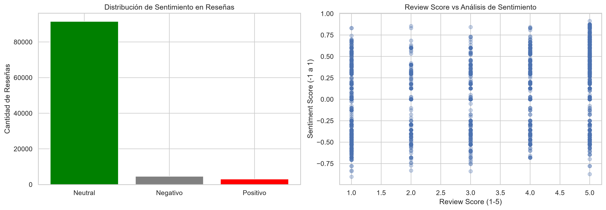
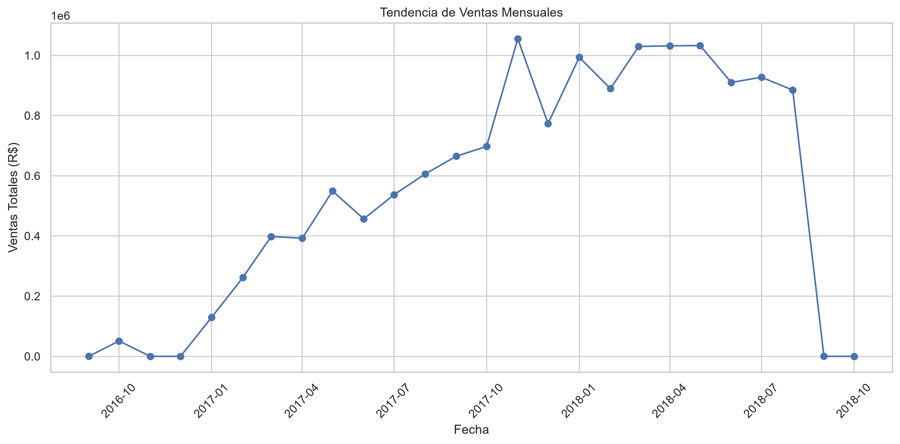
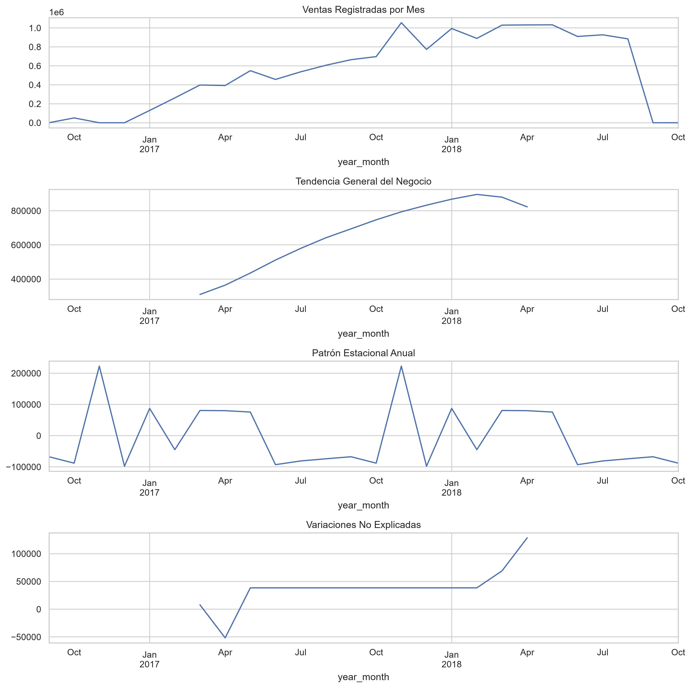
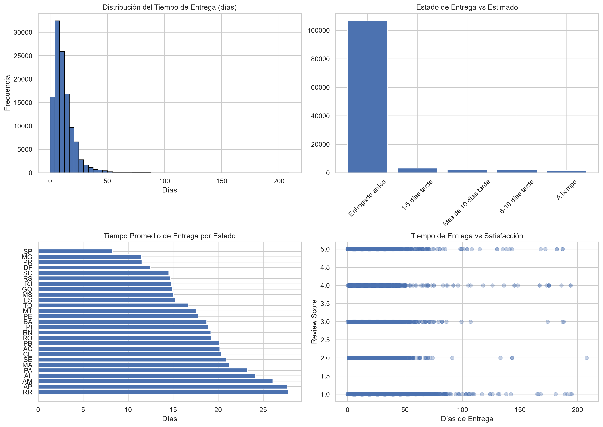
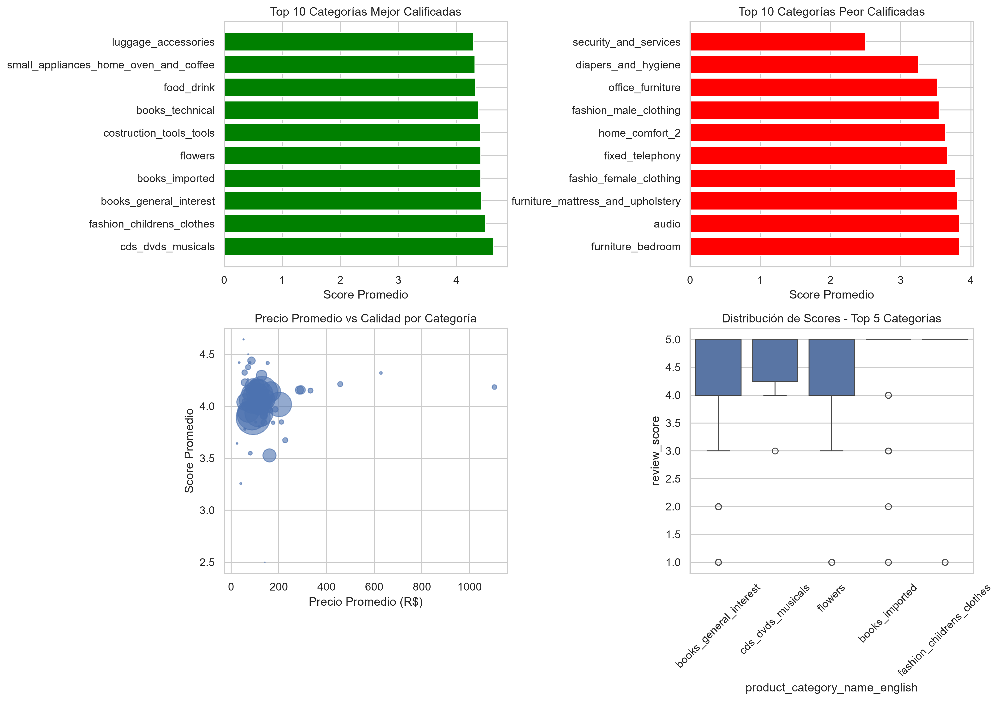
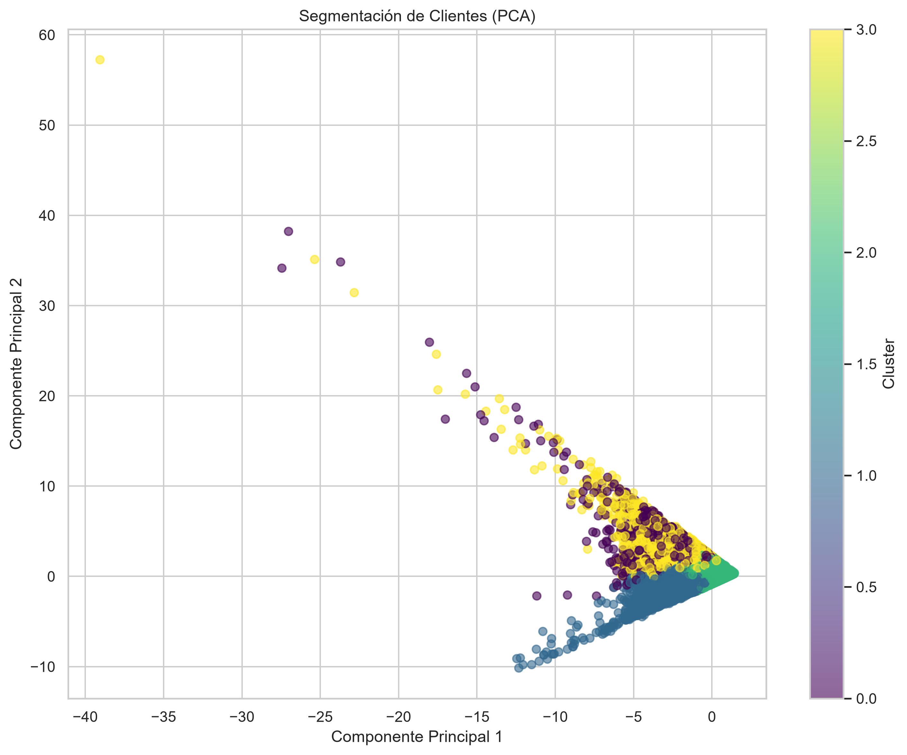
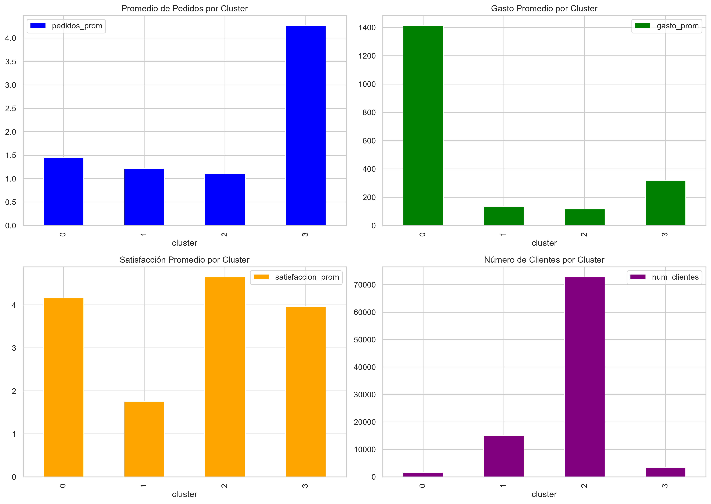

# 🛒 Análisis de E-Commerce Brasileño - Olist Store

## 📋 Descripción del Proyecto
Análisis exploratorio y predictivo del conjunto de datos público de comercio electrónico brasileño de **Olist Store**, que contiene información de **100,000 pedidos** realizados entre **2016 y 2018** en diversos mercados de Brasil.

## 🎯 Objetivos del Análisis
Este proyecto aborda cinco dimensiones clave del negocio:
1. 🗣️ **Análisis de Sentimiento (PLN)** - Procesamiento de lenguaje natural en reseñas.
2. 📈 **Predicción de Ventas** - Modelos de series de tiempo (ARIMA) para forecasting.
3. 🚚 **Rendimiento de Entregas** - Análisis de tiempos y cumplimiento logístico.
4. ⭐ **Calidad de Productos** - Evaluación de satisfacción por categoría.
5. 🎯 **Segmentación de Clientes** - Clustering con K-Means para perfiles de compradores.

---

## 📊 Resumen Ejecutivo y Hallazgos Clave

### 1. Análisis de Sentimiento en Reseñas
- El **~90% de las reseñas son neutrales**, ya que la mayoría de los clientes solo dejan una calificación numérica sin texto.
- Existe una ligera incongruencia entre la puntuación numérica (1-5) y el sentimiento del texto, lo que sugiere que la calificación no siempre refleja la emoción escrita.


### 2. Tendencia y Predicción de Ventas
- Olist demostró un crecimiento explosivo, pasando de ~0 a **~1M R$/mes** entre 2016 y 2018.
- Se identifica un pico claro en **Noviembre 2017 (Black Friday)**, seguido de una estabilización del negocio en 2018.
- La descomposición de series de tiempo confirma un crecimiento orgánico sólido, independiente de la estacionalidad.



### 3. Rendimiento de Entregas
- La gran mayoría de los pedidos (~80%) se entregan en un rango eficiente de **5 a 20 días**.
- Olist tiende a ser conservador en sus estimaciones: la mayoría de los pedidos llegan **"Entregado antes"** de la fecha estimada.
- Existe una disparidad regional significativa: el Sudeste (SP, MG) recibe pedidos en ~8 días, mientras que el Norte (RR, AP) puede tardar hasta ~28 días.


### 4. Calidad de Productos por Categoría
- **No existe correlación directa entre precio y satisfacción**. Categorías baratas y caras muestran variabilidad similar en sus scores.
- Las categorías mejor calificadas suelen ser productos culturales (Libros, CDs) o de nicho, mientras que Moda y Muebles presentan mayores desafíos de satisfacción.


### 5. Segmentación de Clientes (Clustering)
Se identificaron 4 perfiles de clientes mediante K-Means (K=4):
- **Cluster 0 (VIP)**: Bajo volumen de clientes (~1,500), pero con el gasto promedio más alto (~1,400 R$) y buena satisfacción.
- **Cluster 1 (Insatisfechos)**: Clientes con baja recurrencia, bajo gasto y una calificación crítica (~1.7★). Requieren campañas de recuperación.
- **Cluster 2 (Mayoría)**: Representa ~75% de la base. Clientes ocasionales, gasto moderado (~110 R$) y alta satisfacción (~4.7★).
- **Cluster 3 (Frecuentes)**: Clientes con mayor recurrencia de compra (~4.2 pedidos) y gasto medio (~320 R$).



---

## 🛠️ Tecnologías Utilizadas
- **Lenguaje:** Python 3.x
- **Análisis de datos:** Pandas, NumPy
- **Visualización:** Matplotlib, Seaborn, WordCloud
- **Machine Learning:** Scikit-learn (KMeans, PCA, StandardScaler)
- **Procesamiento de Lenguaje Natural:** NLTK, TextBlob
- **Series de tiempo:** Statsmodels (ARIMA, seasonal_decompose)

## 📁 Estructura del Proyecto
```text
olist-ecommerce-analysis/
├── images/                           # Visualizaciones generadas
├── src/                              # Código fuente modular (si aplica)
├── Comercio electrónico brasileño Olist.ipynb  # Notebook principal
├── .gitignore                        # Archivos excluidos del repositorio
└── README.md                         # Este archivo


## 📥 Datos

Los datasets utilizados provienen de [Kaggle - Brazilian E-Commerce by Olist](https://www.kaggle.com/datasets/olistbr/brazilian-ecommerce). 


## 📊 Hallazgos Principales

- Olist creció de 0 a ~1M R$/mes entre 2016 y 2018, con un pico en Black Friday
- El 90% de las reseñas son neutrales (sin texto), limitando el análisis cualitativo
- La mayoría de entregas llegan antes de lo estimado, pero existe disparidad regional
- No hay correlación directa entre precio y satisfacción del cliente
- Se identificaron 4 segmentos de clientes: VIP, Insatisfechos, Mayoría y Frecuentes

## 👤 Autor

Jairo Alonso Gualteros Ortiz  
Analista de Datos | https://www.linkedin.com/in/jairo-alonso-gualteros-ortiz-595541b2/ | jairoalonsogualterosortiz@gmail.com